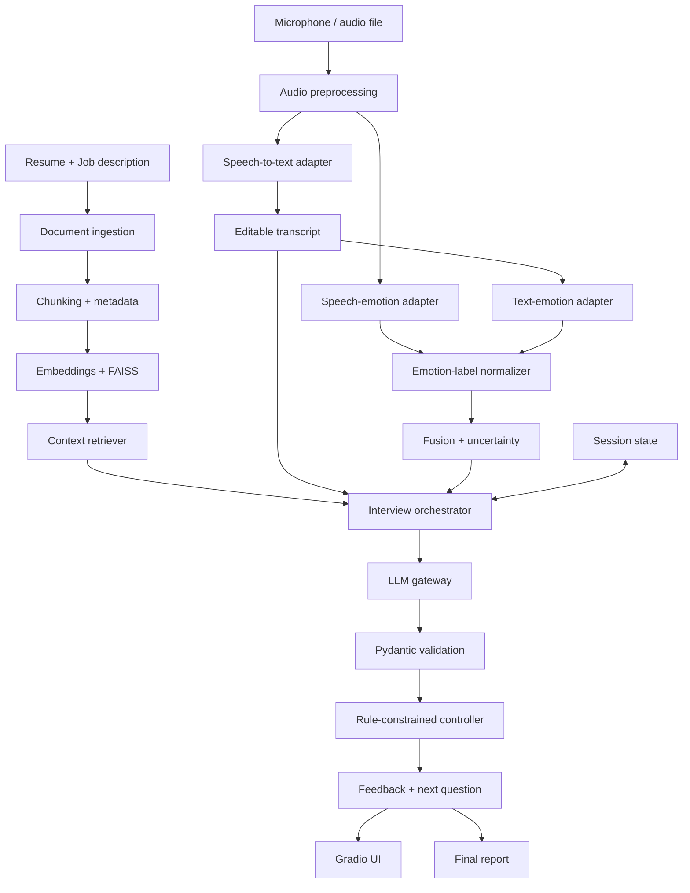
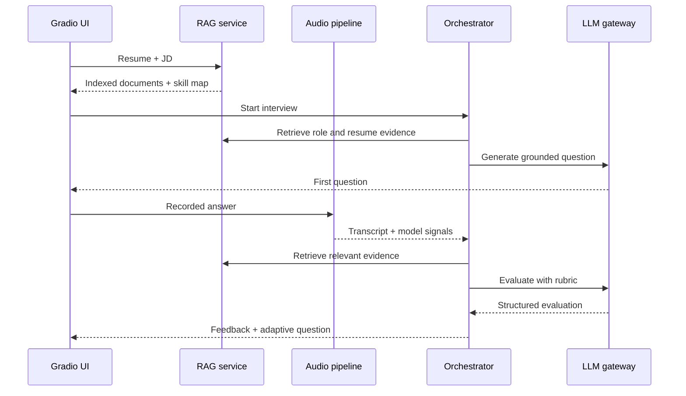
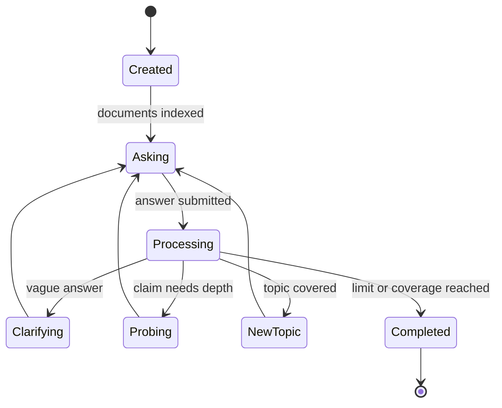

# AI Emotion-Aware Interview Coach

> Coding-agent-ready architecture and 3–4 day implementation specification

## 0. Instructions for the coding agent

Build this project incrementally. Treat this document as the source of truth.

1. Complete milestones in order; do not build the polished UI before the core pipeline works.
2. Use typed interfaces and isolate every external model behind an adapter.
3. Do not silently substitute models or fabricate evaluation results.
4. Keep the application runnable when optional models or API keys are unavailable by returning an explicit degraded-mode message.
5. Validate every LLM response with Pydantic. Retry once on invalid output, then return a controlled error.
6. Write tests as each module is implemented.
7. Never use emotion predictions for hiring recommendations, correctness scoring, or personality/mental-health inference.
8. After every milestone, run tests and update the README with what actually works.

---

# 1. Product definition

## Goal

Create a multimodal GenAI mock-interview application that:

- accepts a candidate resume and target job description;
- generates role-specific interview questions using RAG;
- accepts spoken answers and transcribes them;
- analyzes vocal and textual communication cues using pretrained models;
- evaluates answer content using a structured rubric;
- chooses whether to probe, clarify, change topic, or finish; and
- generates an adaptive next question and final coaching report.

## Non-goals

- No automated hiring, rejection, or candidate ranking.
- No claims that emotion labels reveal a person's true internal state.
- No facial recognition or facial-emotion analysis.
- No training deep-learning models from scratch in the first release.
- No unsupported accuracy numbers.

## Primary demo

1. User uploads a resume and pastes a Citi Data Science job description.
2. The system extracts required skills and retrieves matching resume evidence.
3. The interviewer asks a grounded question.
4. User records an answer.
5. The application shows the transcript, communication signals, content scores, evidence-based feedback, and an adaptive follow-up.
6. After 4–6 questions, the system generates a downloadable final report.

---

# 2. Architecture at a glance



## Runtime sequence



## Major decisions

| Area | Decision |
|---|---|
| Application | Modular Python application with Gradio UI |
| API | Add FastAPI on Day 3; UI initially calls services directly |
| STT | `faster-whisper`, behind an adapter |
| Speech emotion | Pretrained Hugging Face Wav2Vec2-based SER model |
| Text emotion | Pretrained DistilBERT/RoBERTa classifier |
| RAG | Sentence Transformers + FAISS |
| LLM | Provider-neutral gateway supporting API or local model |
| Agent behavior | Deterministic state machine + validated LLM suggestions |
| State | In-memory store first; SQLite optional |
| Schemas | Pydantic v2 |
| Testing | Pytest; mock model adapters in unit tests |
| Observability | Structured logs with latency and failure reason |

---

# 3. Technology stack

## Core dependencies

```text
python >= 3.11
gradio
fastapi
uvicorn
pydantic >= 2
python-multipart
transformers
torch
faster-whisper
sentence-transformers
faiss-cpu
pymupdf
numpy
soundfile
librosa
python-dotenv
httpx
tenacity
pytest
pytest-asyncio
```

Pin versions only after confirming a working environment. Generate the lock file from tested versions rather than guessing them.

## Environment configuration

```dotenv
LLM_PROVIDER=
LLM_MODEL=
LLM_API_KEY=
STT_MODEL_SIZE=small
SPEECH_EMOTION_MODEL=
TEXT_EMOTION_MODEL=
EMBEDDING_MODEL=sentence-transformers/all-MiniLM-L6-v2
MAX_INTERVIEW_QUESTIONS=5
DATA_RETENTION=false
```

Select exact emotion-model IDs only after checking license, labels, language, sampling rate, CPU feasibility, and model-card limitations. Record these in `MODEL_CARD.md`.

---

# 4. Repository structure

```text
ai-emotion-interview-coach/
├── app.py
├── pyproject.toml
├── README.md
├── MODEL_CARD.md
├── .env.example
├── .gitignore
├── src/interview_coach/
│   ├── __init__.py
│   ├── config.py
│   ├── schemas.py
│   ├── exceptions.py
│   ├── logging_config.py
│   ├── api/
│   │   ├── app.py
│   │   └── routes.py
│   ├── audio/
│   │   ├── preprocessing.py
│   │   ├── stt.py
│   │   └── speech_emotion.py
│   ├── nlp/
│   │   ├── text_emotion.py
│   │   ├── label_mapping.py
│   │   └── fusion.py
│   ├── rag/
│   │   ├── parser.py
│   │   ├── chunker.py
│   │   ├── vector_store.py
│   │   └── retriever.py
│   ├── llm/
│   │   ├── gateway.py
│   │   ├── prompts.py
│   │   └── structured_output.py
│   ├── interview/
│   │   ├── orchestrator.py
│   │   ├── controller.py
│   │   ├── rubric.py
│   │   └── report.py
│   └── storage/
│       └── session_store.py
├── prompts/
│   ├── extract_job_requirements.md
│   ├── generate_question.md
│   ├── evaluate_answer.md
│   └── final_report.md
├── data/
│   ├── samples/
│   │   ├── sample_resume.txt
│   │   └── sample_jd.txt
│   └── evaluation/
│       ├── retrieval_cases.json
│       ├── interview_answers.json
│       └── audio_manifest.csv
├── tests/
│   ├── unit/
│   ├── integration/
│   └── fixtures/
├── evaluation/
│   ├── evaluate_retrieval.py
│   ├── evaluate_structured_output.py
│   ├── evaluate_emotion_models.py
│   ├── run_ablation.py
│   └── results/
└── docs/
    ├── architecture.md
    └── demo_script.md
```

---

# 5. Domain models

All core modules exchange typed objects, not unstructured dictionaries.

```python
from typing import Literal
from pydantic import BaseModel, Field

class DocumentChunk(BaseModel):
    chunk_id: str
    source: Literal["resume", "job_description", "rubric"]
    section: str | None = None
    text: str
    metadata: dict[str, str] = Field(default_factory=dict)

class RetrievedEvidence(BaseModel):
    chunk_id: str
    source: str
    text: str
    score: float

class EmotionPrediction(BaseModel):
    raw_label: str
    normalized_label: Literal[
        "positive_confident", "neutral", "uncertain_hesitant", "negative_frustrated"
    ]
    confidence: float = Field(ge=0, le=1)
    probabilities: dict[str, float]
    model_id: str

class CommunicationSignal(BaseModel):
    label: str
    confidence: float = Field(ge=0, le=1)
    status: Literal["available", "low_confidence", "unavailable"]
    explanation: str

class Scorecard(BaseModel):
    relevance: int = Field(ge=1, le=10)
    clarity: int = Field(ge=1, le=10)
    structure: int = Field(ge=1, le=10)
    technical_depth: int = Field(ge=1, le=10)
    evidence: int = Field(ge=1, le=10)

class AnswerEvaluation(BaseModel):
    scores: Scorecard
    strengths: list[str] = Field(max_length=3)
    improvements: list[str] = Field(max_length=3)
    improved_answer_outline: list[str]
    evidence_used: list[str]
    next_action_suggestion: Literal["probe", "clarify", "change_topic", "finish"]
    suggested_next_question: str

class InterviewTurn(BaseModel):
    turn_number: int
    question: str
    transcript: str
    speech_emotion: EmotionPrediction | None
    text_emotion: EmotionPrediction | None
    communication_signal: CommunicationSignal
    evaluation: AnswerEvaluation

class InterviewSession(BaseModel):
    session_id: str
    role: str
    interview_type: Literal["behavioral", "technical", "mixed"]
    difficulty: Literal["beginner", "intermediate", "advanced"]
    max_questions: int = 5
    required_skills: list[str]
    covered_skills: list[str] = Field(default_factory=list)
    turns: list[InterviewTurn] = Field(default_factory=list)
    status: Literal["created", "active", "completed", "failed"] = "created"
```

---

# 6. Component specifications

## 6.1 Document ingestion

- Accept `.pdf`, `.txt`, and pasted text.
- Extract PDFs with PyMuPDF.
- Normalize whitespace without destroying headings.
- Reject encrypted, empty, oversized, or unsupported documents.
- Label sections when detectable.
- Treat all uploaded content as untrusted data.

Chunking defaults: 400–600 tokens, 50–80 token overlap, source/section metadata, and never combine resume with JD in one chunk.

## 6.2 RAG service

- Embed/index chunks.
- Retrieve separately from resume and JD using metadata filters.
- Return source, chunk ID, text, and similarity score.
- Show retrieved evidence in the UI.
- Default per query: top 3 JD + top 3 resume chunks, deduplicated.

```python
class Retriever(Protocol):
    def index(self, chunks: list[DocumentChunk]) -> None: ...
    def search(self, query: str, source: str | None, k: int) -> list[RetrievedEvidence]: ...
```

## 6.3 Speech-to-text

- Convert audio to mono 16 kHz PCM.
- Enforce duration/file-size limits.
- Transcribe using `faster-whisper`.
- Return transcript, language, duration, and latency.
- Let the user correct the transcript before final evaluation.
- Never evaluate an empty or obviously failed transcript.

## 6.4 Emotion adapters

- Load models lazily.
- Use each model's required sampling rate and preprocessing.
- Return all label probabilities, model ID, and latency.
- Run text emotion only on the answer transcript.
- Return `unavailable` on inference failure without blocking the interview.

## 6.5 Label normalization and fusion

Define explicit mapping tables; do not guess labels using runtime substrings.

```python
fused[label] = 0.60 * speech_probs[label] + 0.40 * text_probs[label]
```

- Weights are configurable heuristics.
- If one modality fails, use the other and label it single-modality.
- Below `0.55` top confidence, use `low_confidence`.
- Present predictions as possible communication cues.
- Never modify content scores using emotion predictions.

## 6.6 LLM gateway

- Provider-neutral `generate_structured()` method.
- Central timeout, retry, token, temperature, and error handling.
- Validate against a supplied Pydantic schema.
- Retry invalid JSON once using the validation error.
- Never log documents/transcripts by default.

```python
class LLMGateway(Protocol):
    async def generate_structured(
        self,
        system_prompt: str,
        user_prompt: str,
        output_schema: type[BaseModel],
    ) -> BaseModel: ...
```

## 6.7 Interview controller

This is the agentic component: a state machine, not an unconstrained agent.



```python
if session.turn_count >= session.max_questions:
    return "finish"
if transcript_word_count < 20 or evaluation.scores.relevance <= 4:
    return "clarify"
if evaluation.scores.technical_depth <= 6 and contains_technical_claim(transcript):
    return "probe"
if current_topic_question_count >= 2:
    return "change_topic"
return validated_llm_suggestion
```

Hard rules override unsafe or inconsistent LLM suggestions.

## 6.8 Orchestrator

One service coordinates each turn:

```python
async def process_answer(session_id: str, audio_path: Path) -> TurnResult:
    session = store.get(session_id)
    audio = preprocess(audio_path)
    transcript_result, speech_signal = await gather_safely(
        stt.transcribe(audio), speech_emotion.predict(audio)
    )
    text_signal = text_emotion.predict(transcript_result.text)
    communication = fusion.combine(speech_signal, text_signal)
    evidence = retriever.search(transcript_result.text, source=None, k=6)
    evaluation = await evaluator.evaluate(session, transcript_result.text, evidence, communication)
    action = controller.choose(session, evaluation, transcript_result.text)
    next_question = await question_service.generate(session, action, evidence)
    return store.append_turn(...)
```

STT failure blocks evaluation. Emotion failure does not.

---

# 7. Prompt contracts

## Requirement extraction

Return target role, responsibilities, required/preferred skills, and evaluation topics without inventing requirements.

## Question generation

Inputs: role, difficulty, interview type, skill coverage, retrieved evidence, last turn, and controller action.

Constraints:

- ask exactly one question;
- ground it in retrieved context;
- do not reveal an ideal answer;
- do not repeat earlier questions;
- when probing, reference the candidate's actual claim;
- return question, topic, evidence IDs, and rationale.

## Answer evaluation

- Score answer content only.
- Keep communication cues separate.
- Cite only supplied evidence IDs.
- Return at most three strengths and three improvements.
- Generate a concise STAR or technical-answer outline.
- Avoid hiring recommendations.
- Return the `AnswerEvaluation` schema.

| Score | Meaning |
|---|---|
| 1–3 | Largely irrelevant, unclear, or unsupported |
| 4–6 | Partly relevant but generic, incomplete, or weakly supported |
| 7–8 | Relevant, structured, specific, and supported |
| 9–10 | Precise, deeply reasoned, quantified, and role-specific |

---

# 8. API contract

| Method | Endpoint | Purpose |
|---|---|---|
| `GET` | `/health` | Health and model status |
| `POST` | `/sessions` | Create session |
| `POST` | `/sessions/{id}/documents` | Upload/index resume and JD |
| `POST` | `/sessions/{id}/start` | Generate first question |
| `POST` | `/sessions/{id}/answers` | Submit audio/process turn |
| `PATCH` | `/sessions/{id}/turns/{n}/transcript` | Correct and re-evaluate transcript |
| `GET` | `/sessions/{id}` | Retrieve state/history |
| `POST` | `/sessions/{id}/complete` | Generate final report |
| `GET` | `/sessions/{id}/report` | Download JSON/Markdown report |

Example response:

```json
{
  "turn_number": 2,
  "transcript": "I developed a CPU-first document-processing pipeline...",
  "communication_signal": {
    "label": "mostly_confident",
    "confidence": 0.66,
    "status": "available"
  },
  "evaluation": {
    "scores": {
      "relevance": 9,
      "clarity": 8,
      "structure": 7,
      "technical_depth": 7,
      "evidence": 8
    },
    "strengths": ["Quantified the result"],
    "improvements": ["Explain the validation strategy"],
    "evidence_used": ["resume_experience_02", "jd_responsibilities_01"],
    "next_action_suggestion": "probe",
    "suggested_next_question": "What validation design produced the reported accuracy?"
  },
  "controller_action": "probe",
  "next_question": "What validation design produced the reported accuracy?"
}
```

---

# 9. UI specification

Use Gradio Blocks with four views:

1. **Setup:** resume, JD, role, difficulty, interview type, question count, model status.
2. **Interview:** current question, microphone/upload, transcript editor, submit/re-evaluate, progress.
3. **Feedback:** score cards, strengths, improvements, answer outline, uncertain communication signal, raw probabilities, retrieved evidence.
4. **Final report:** per-question summary, trends, recurring gaps, practice plan, Markdown/JSON download.

Never display a single employability score.

---

# 10. Degraded modes

| Failure | Behavior |
|---|---|
| Empty/corrupt audio | Ask user to record again |
| STT failure | Stop turn; do not evaluate |
| One emotion model fails | Continue with other modality and label it |
| Both emotion models fail | Continue content evaluation without signal |
| Empty/unreadable resume | Ask for corrected document |
| Empty JD | Allow clearly labeled generic mode |
| Retrieval finds nothing useful | Ask generic role question; invent nothing |
| Invalid LLM output | Retry once, then controlled error |
| LLM/API unavailable | Preserve session and allow retry |

---

# 11. Testing strategy

## Unit tests

- document normalization and metadata;
- explicit label mappings;
- fusion and low-confidence logic;
- controller transitions and limits;
- schema validation/retry;
- empty-transcript guard;
- degraded model behavior.

## Integration tests

- ingestion through retrieval;
- audio fixture through transcription;
- mocked models through a complete turn;
- invalid JSON followed by successful retry;
- interview completion/report generation;
- FastAPI happy and error paths.

## End-to-end acceptance

Using a sample IDP resume and Citi-style JD:

1. first question references a relevant skill;
2. audio is transcribed and editable;
3. both model outputs are shown separately;
4. feedback uses supplied evidence only;
5. vague answers trigger clarification;
6. quantified claims trigger probing;
7. interview stops at the configured limit;
8. final Markdown report downloads.

---

# 12. Evaluation plan

| Component | Metric |
|---|---|
| STT | Word error rate |
| Speech/text emotion | Accuracy, macro-F1, confusion matrix |
| Retrieval | Recall@k and human relevance rating |
| Structured generation | Schema-valid response rate |
| Grounding | Supported factual-claim percentage |
| Follow-up quality | Human relevance/specificity rating |
| System | Median/p95 latency and failure rate |

Minimum dataset:

- 20–30 varied text answers;
- 15–20 audio answers across several speakers if available;
- 25 retrieval queries with labeled relevant chunks;
- repeated structured-output and latency runs;
- two human raters for a small feedback subset if feasible.

## Ablation

Compare:

1. transcript-only LLM;
2. transcript + resume/JD RAG;
3. transcript + RAG + multimodal communication signal.

Study whether RAG improves grounding/specificity, whether multimodal context improves communication feedback, whether content scores stay stable, and what latency each layer adds.

Store reproducible results in `evaluation/results/`. Do not claim metrics before this.

---

# 13. Privacy and responsible use

- This is practice software, not an employment decision system.
- Emotion outputs are uncertain and affected by audio quality, accent, language, disability, culture, and bias.
- Do not infer honesty, personality, mental health, competence, or protected traits.
- Do not alter content scores using emotion outputs.
- Allow transcript correction.
- Do not retain audio/documents by default.
- Never log private text or keys by default.
- Validate extensions, MIME types, sizes, and audio duration.
- Escape rendered content and treat uploads as untrusted.

---

# 14. Four-day execution plan

## Day 1 — Working vertical slice

Goal: typed answer → grounded question → structured feedback → follow-up.

- Initialize package, config, schemas, logging, tests.
- Build parsing, chunking, embeddings, FAISS retrieval.
- Build LLM gateway and Pydantic validation.
- Add requirement/question/evaluation prompts.
- Add session store and controller.
- Build minimal text-only Gradio UI.

**Exit:** complete two-turn text interview grounded in sample resume/JD.

## Day 2 — Multimodal pipeline

- Add audio validation/preprocessing.
- Add faster-whisper.
- Add speech/text emotion adapters.
- Add explicit mappings and fusion.
- Run STT and speech emotion concurrently where safe.
- Add transcript editing and degraded modes.

**Exit:** spoken answer produces transcript, separate signals, feedback, and next question.

## Day 3 — API and complete interview

- Add FastAPI endpoints.
- Complete controller state and skill coverage.
- Add final reports.
- Add structured logs/latency.
- Expand unit/integration failure tests.
- Connect Gradio through a clean service/API boundary.

**Exit:** 4–6 question interview and downloadable report.

## Day 4 — Evaluation and presentation

- Assemble evaluation sets.
- Run retrieval, schema, grounding, and latency evaluation.
- Run ablation.
- Test multiple voices/audio qualities where possible.
- Fix major observed failures.
- Finish README, model card, screenshots, architecture notes, and demo script.
- Record a short demo.

**Exit:** reproducible results and an installable, understandable project.

---

# 15. Definition of done

- [ ] Setup works from documented commands.
- [ ] Resume/JD index successfully.
- [ ] Questions are grounded and expose evidence IDs.
- [ ] Spoken answers are transcribed and editable.
- [ ] Speech/text signals remain separate with uncertainty.
- [ ] Content scoring is independent of emotion.
- [ ] Controller actions are deterministic/testable.
- [ ] Multi-turn interview and final report work.
- [ ] Failures degrade safely.
- [ ] Evaluation scripts produce stored results.
- [ ] Resume claims match measured results.

---

# 16. Resume bullets after implementation

> Built a multimodal GenAI interview coach combining Whisper-based transcription, transformer speech/text emotion models, resume–job-description RAG, and a rule-constrained LLM controller to deliver grounded feedback and adaptive follow-up questions.

> Developed typed Python/FastAPI services for document retrieval, multimodal inference, schema-validated LLM evaluation, session state, and graceful model fallbacks, with a Gradio interface for multi-turn voice interviews.

Metrics template:

> Evaluated the system on **[N]** test cases, achieving **[X%]** schema-valid responses, **[Y]** retrieval Recall@k, and **[Z seconds]** median latency; ablation testing quantified the impact of RAG and multimodal context.

Use only measured values.

---

# 17. Initial Codex commands

Attach this specification and begin with:

```text
Build the AI Emotion-Aware Interview Coach described in the attached specification.

Start with Day 1 foundation only. First inspect the workspace and AGENTS.md instructions. Then:
1. create the proposed Python package and repository structure;
2. add configuration, typed Pydantic domain schemas, custom exceptions, and structured logging;
3. add a minimal pyproject.toml and .env.example without inventing API keys;
4. implement unit tests for schemas and configuration;
5. run tests and report exact results.

Do not implement audio, model downloads, RAG, FastAPI, or UI yet. Do not silently choose model IDs. Keep external services behind interfaces. Preserve existing user files and stop if a dependency or architecture choice materially conflicts with the specification.
```

After that passes:

```text
Continue with Day 1's working vertical slice. Implement document parsing, chunking, FAISS retrieval, a provider-neutral LLM gateway, schema-validated question generation/evaluation, session state, deterministic controller, and minimal text-only Gradio interface. Use fixtures and mocks so tests do not require paid APIs. Run unit and integration tests, then demonstrate a two-turn interview using the sample resume and JD. Do not begin audio work yet.
```

Continue one milestone at a time; do not ask Codex to implement the entire four-day system in one turn.
