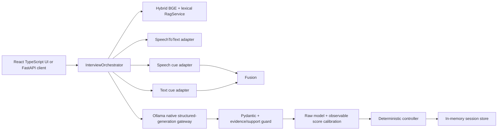

# Architecture

The system is deliberately a pipeline with typed boundaries, not an unconstrained autonomous agent.

## Dependency direction

Transport code calls the orchestrator. The orchestrator depends on protocols/adapters and Pydantic domain
objects. Model libraries are imported lazily inside adapters, so importing the core never downloads or
loads a model. The session store and retrieval indexes are process-local in this release.

The production web client lives under `frontend/`. Vite builds static assets that FastAPI serves from `/`,
while `/sessions`, `/health`, and `/docs` remain API routes. Development mode uses Vite's proxy so the same
relative API client works without environment-specific URLs.

## Turn transaction

1. Validate the active session and optional audio.
2. Run speech classification and STT concurrently when a transcript is not already supplied.
3. Treat STT/empty transcript failure as blocking; suppress only optional cue-model failure.
4. Retrieve up to three resume and three JD chunks using dense/lexical fusion; exclude flagged chunks
   from generation while retaining them for audit.
5. Evaluate content against supplied evidence and validate the response schema.
6. Reject any model-cited evidence ID that was not supplied and run lexical/semantic support checks.
7. Retain raw LLM scores and calibrate them against observable answer signals.
8. Apply controller rules; hard rules override the model suggestion.
9. Generate one grounded follow-up or finish, then atomically replace the stored session copy.

## Why the controller is deterministic

The LLM can suggest an action, but product invariants—question limit, vague-answer clarification,
technical-claim probing, and topic repetition—are ordinary code. This makes transitions unit-testable,
prevents loops, and keeps safety/termination outside probabilistic generation.

## Production evolution

Replace the in-memory store with a repository backed by PostgreSQL/SQLite and optimistic concurrency;
move model work to bounded workers; add auth, rate limiting, tracing, encrypted object storage, deletion
jobs, model revision pinning, prompt/version registries, and offline/online evaluation gates. Do not add
emotion-derived hiring scores.
